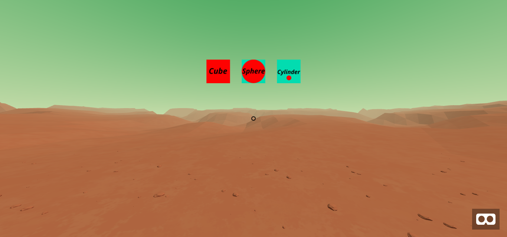
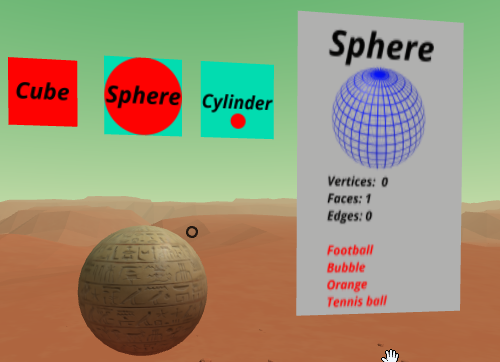
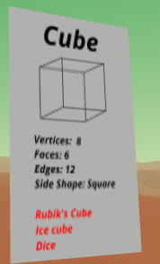

# VR Maths Shapes

This is a teaching tool that uses VR technology to learn about 3D Shapes.

## Features:

- Visual 3D Shapes
- Different textures
- Shape information such as vertices and faces
- Shape names are read aloud to help ESOL (non-native English speaking) students
- A calming, focused enviroment with ambient sounds

## Screenshots:

## Technical details:

This tool uses a-frame to create virual reality in the web.
It is based on the DOM, using HTML to create entites, and components written in Javascript.

## License:

[This project uses the MIT Licence](LICENSE)
